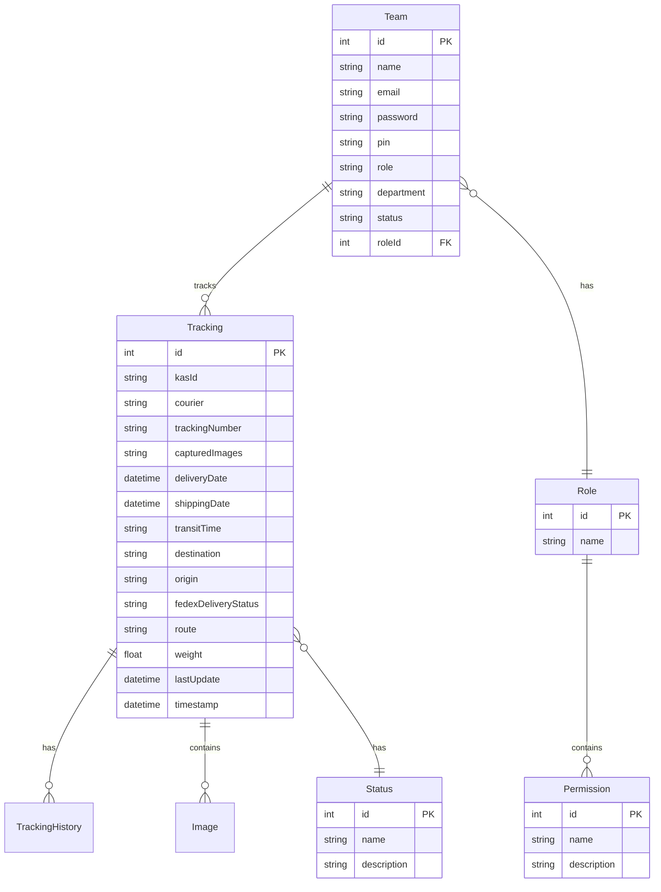

# FedEx Package Tracking System

[](https://nextjs.org/)
[](https://www.typescriptlang.org/)
[](https://www.prisma.io/)
[](https://tailwindcss.com/)

A comprehensive, enterprise-grade package tracking system built with Next.js that enables organizations to efficiently track, manage, and monitor FedEx packages with real-time updates, role-based access control, and powerful analytics.


## ✨ Key Features

### 📦 Package Management

- **Real-time FedEx tracking** integration via official FedEx API
- **Multi-carrier support** with automatic carrier detection
- **Duplicate tracking prevention** with intelligent validation
- **Package history tracking** with detailed status updates
- **Bulk operations** for managing multiple packages

### 🔐 Security & Access Control

- **Role-based access control** (Admin, Manager, User)
- **JWT authentication** with secure session management
- **Permission-based feature access**
- **Team invitation system** with email verification
- **Secure API endpoints** with middleware protection

### 📊 Analytics & Reporting

- **Interactive dashboards** with real-time statistics
- **Historical reports** with trend analysis
- **Performance metrics** including transit time analysis
- **Visual charts** using Recharts for data visualization
- **Export capabilities** for external reporting

### 📱 Modern User Experience

- **Progressive Web App (PWA)** with offline support
- **Responsive design** optimized for all devices
- **Dark/light theme** support
- **Real-time updates** with optimistic UI
- **Image capture & upload** for package documentation

## 🏗️ Architecture

### Technology Stack

**Frontend**

- **Next.js 14** - React framework with App Router
- **TypeScript** - Type-safe development
- **Tailwind CSS** - Utility-first styling
- **shadcn/ui** - Modern component library
- **Recharts** - Interactive data visualization

**Backend**

- **Next.js API Routes** - RESTful API endpoints
- **Prisma ORM** - Type-safe database access
- **SQLite/PostgreSQL** - Database management
- **JWT** - Secure authentication

**Infrastructure**

- **MinIO** - Object storage for images
- **Redis** - Caching and session management
- **FedEx API** - Official tracking data source
- **Mailgun** - Email service integration

### Database Schema



## 🚀 Quick Start

### Prerequisites

- **Node.js** 18+
- **npm/yarn/bun** package manager
- **SQLite** (development) or **PostgreSQL** (production)
- **Redis** server
- **MinIO** server (for file storage)

### Installation

1. **Clone the repository**

   ```bash
   git clone <repository-url>
   cd fedexpp
   ```

2. **Install dependencies**

   ```bash
   npm install
   # or
   yarn install
   # or
   bun install
   ```

3. **Environment setup**

   ```bash
   cp .env.example .env.local
   ```

   Configure your environment variables:

   ```env
   # Database
   DATABASE_URL="file:./prisma/database/develop.sqlite"

   # FedEx API
   FEDEX_API_URL="https://apis.fedex.com"
   NEXT_PUBLIC_FEDEX_API_KEY="your_api_key"
   FEDEX_SECRET_KEY="your_secret_key"

   # MinIO Storage
   MINIO_ENDPOINT="your_minio_endpoint"
   MINIO_PORT="9000"
   MINIO_ACCESS_KEY="your_access_key"
   MINIO_SECRET_KEY="your_secret_key"
   MINIO_BUCKET_NAME="fedex-tracking"

   # Redis
   REDIS_URL="redis://localhost:6379"

   # Email (Mailgun)
   MAILGUN_API_KEY="your_mailgun_key"
   MAILGUN_DOMAIN="your_domain"

   # JWT
   JWT_SECRET="your_jwt_secret"

   # Application
   NEXT_PUBLIC_BASE_URL="http://localhost:3000"
   ```

4. **Database setup**

   ```bash
   npx prisma generate
   npx prisma db push
   npx prisma db seed
   ```

5. **Start development server**

   ```bash
   npm run dev
   ```

6. **Access the application**
   Open [http://localhost:3000](http://localhost:3000) in your browser

### Default Credentials

After seeding, use these credentials to log in:

- **Admin**: `admin@example.com` / `admin123`
- **Manager**: `manager@example.com` / `manager123`
- **User**: `user@example.com` / `user123`

## 📖 Usage Guide

### Dashboard Overview

The main dashboard provides:

- **Package count statistics** with visual indicators
- **Quick tracking form** for new package submissions
- **Recent packages list** with status filtering
- **Search functionality** across all tracking data

### Tracking a Package

1. **Navigate** to the dashboard
2. **Enter tracking number** in the tracking form
3. **Select status** from the dropdown
4. **Capture images** (optional) using the camera integration
5. **Submit** - the system will automatically detect the carrier and fetch data

### Managing Team Members

Admins can:

- **Invite new users** via email
- **Assign roles** and permissions
- **Manage user status** (active/inactive)
- **Configure department assignments**

### Generating Reports

Access comprehensive reports including:

- **Delivery performance metrics**
- **Transit time analysis**
- **Status distribution charts**
- **Historical trend data**
- **Export options** for external systems

## 🛠️ Development

### Available Scripts

```bash
npm run dev          # Start development server
npm run build        # Build for production
npm run start        # Start production server
npm run lint         # Run ESLint
npm run seed         # Seed database with sample data
```

### Project Structure

```
fedexpp/
├── app/                    # Next.js App Router pages
│   ├── api/               # API routes
│   ├── dashboard/         # Dashboard pages
│   └── login/            # Authentication pages
├── components/            # Reusable UI components
│   ├── ui/               # shadcn/ui components
│   ├── reports/          # Report-specific components
│   └── settings/         # Settings components
├── contexts/             # React contexts
├── hooks/                # Custom React hooks
├── lib/                  # Utility libraries
├── prisma/               # Database schema & migrations
├── public/               # Static assets
├── types/                # TypeScript type definitions
└── utils/                # Helper utilities
```

### API Routes

| Endpoint                  | Method          | Description                 |
| ------------------------- | --------------- | --------------------------- |
| `/api/auth/login`         | POST            | User authentication         |
| `/api/fedex-tracking`     | GET/POST/DELETE | Package tracking operations |
| `/api/fedex-packages`     | POST            | Save tracking data          |
| `/api/team-members`       | GET             | List team members           |
| `/api/historical-reports` | GET             | Historical data             |
| `/api/status`             | GET             | Available status types      |

### Database Operations

```bash
# Generate Prisma client
npx prisma generate

# Push schema changes
npx prisma db push

# Run migrations
npx prisma migrate dev

# Open Prisma Studio
npx prisma studio

# Reset database
npx prisma db reset
```

## 🚀 Deployment

### Production Considerations

1. **Database Migration**

   - Migrate from SQLite to PostgreSQL/MySQL for production
   - Configure connection pooling
   - Set up automated backups

2. **Environment Variables**

   - Use production-grade secrets management
   - Configure CORS policies
   - Enable HTTPS enforcement

3. **Performance Optimization**

   - Enable Redis caching
   - Configure CDN for static assets
   - Implement image optimization
   - Set up monitoring and logging

4. **Security Hardening**
   - Configure secure headers
   - Enable rate limiting
   - Set up SSL certificates
   - Implement API key rotation

### Deployment Options

**Vercel (Recommended)**

```bash
vercel --prod
```

**Docker**

```dockerfile
FROM node:18-alpine
WORKDIR /app
COPY . .
RUN npm install && npm run build
EXPOSE 3000
CMD ["npm", "start"]
```

**PM2 (Node.js)**

```bash
npm install -g pm2
pm2 start ecosystem.config.js
```

## 🔧 Configuration

### FedEx API Setup

1. **Register** at [FedEx Developer Portal](https://developer.fedex.com)
2. **Create application** and obtain API credentials
3. **Configure environment variables** with your keys
4. **Test connection** using the tracking form

### MinIO Storage Setup

1. **Install MinIO** server
2. **Create bucket** for image storage
3. **Configure access policies**
4. **Set CORS policies** for web access

### Email Configuration

1. **Set up Mailgun account**
2. **Verify domain**
3. **Configure API keys**
4. **Customize email templates** in `/emails/`

## 🤝 Contributing

We welcome contributions! Please see our [Contributing Guidelines](CONTRIBUTING.md) for details.

1. **Fork** the repository
2. **Create** a feature branch
3. **Make** your changes
4. **Add** tests if applicable
5. **Submit** a pull request

### Development Guidelines

- **Follow TypeScript best practices**
- **Use conventional commit messages**
- **Add JSDoc comments** for complex functions
- **Update documentation** for new features
- **Test thoroughly** before submitting

## 📋 Roadmap

### Short Term (Q1 2025)

- [ ] Multi-carrier support (UPS, USPS, DHL)
- [ ] Advanced search filters
- [ ] Bulk import/export functionality
- [ ] Mobile app development
- [ ] Webhook support

### Long Term (2025)

- [ ] Machine learning insights
- [ ] API rate limiting dashboard
- [ ] Advanced analytics platform
- [ ] Third-party integrations
- [ ] Microservices architecture

## 🐛 Troubleshooting

### Common Issues

**FedEx API Connection**

```bash
# Check API credentials
curl -X POST "https://apis.fedex.com/oauth/token" \
  -H "Content-Type: application/x-www-form-urlencoded" \
  -d "grant_type=client_credentials&client_id=YOUR_KEY"
```

**Database Issues**

```bash
# Reset database
npx prisma db reset

# Check migrations
npx prisma migrate status
```

**Image Upload Problems**

- Verify MinIO server is running
- Check bucket permissions
- Validate file size limits

## 📄 License

This project is licensed under the MIT License - see the [LICENSE](LICENSE) file for details.

## 🙏 Acknowledgments

- **FedEx** for providing the tracking API
- **Vercel** for Next.js framework
- **Prisma** for excellent ORM
- **shadcn** for beautiful UI components
- **Community contributors** for ongoing support

## 📞 Support

For technical support or questions:

- **Create an issue** on GitHub
- **Email**: support@yourcompany.com
- **Documentation**: [View detailed docs](PROJECT_DOCUMENTATION.md)

---

**Built with ❤️ for efficient package tracking**

_Last updated: January 2025_
